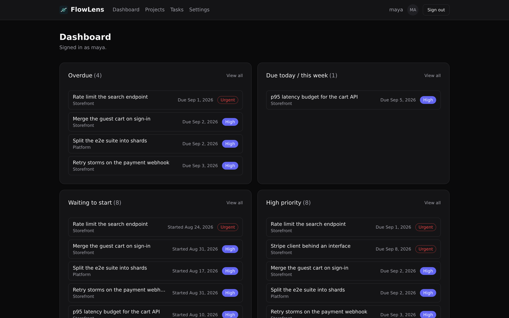
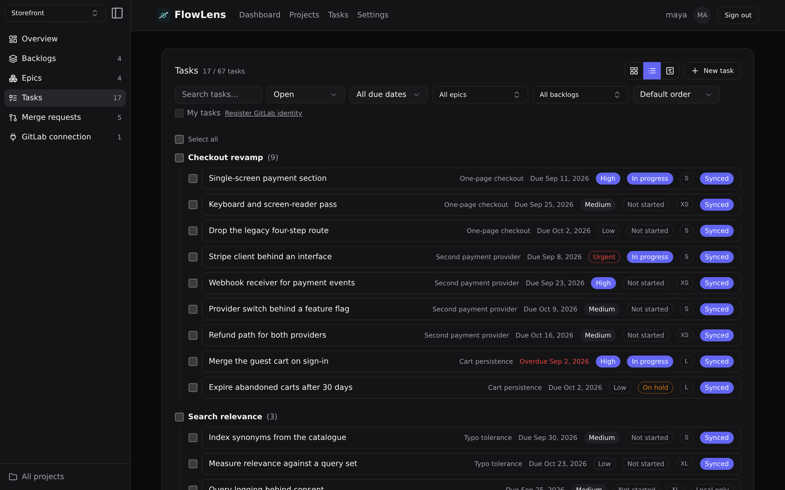
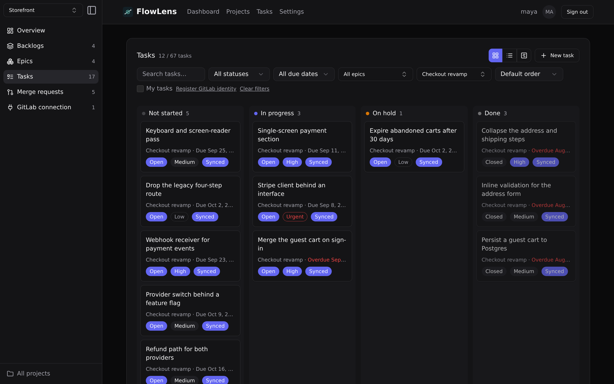
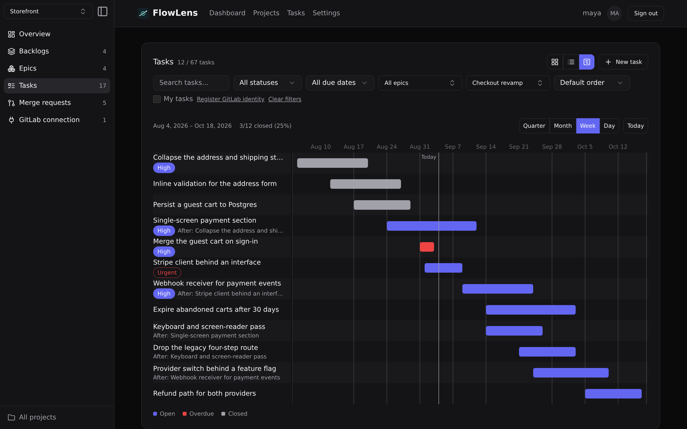
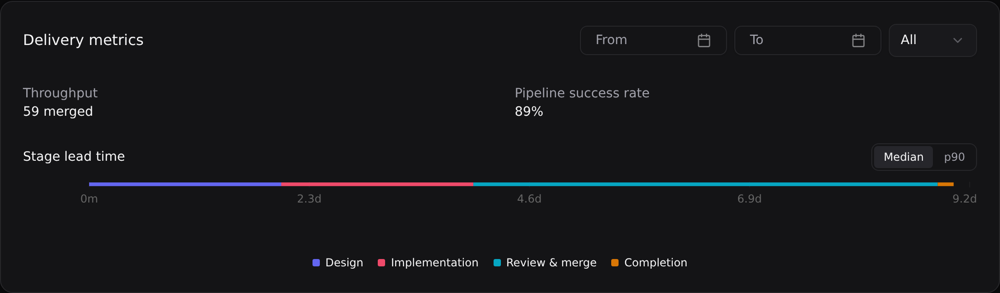
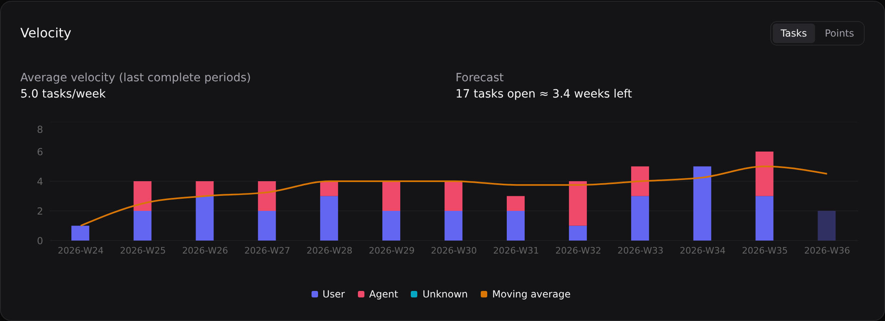

# FlowLens

A self-hosted task tracker — backlogs, epics, tasks, board, Gantt timeline
and delivery metrics — that can optionally keep every task 1:1 with a
GitLab CE issue, and read your merge request and CI data to show where
delivery actually gets stuck.

It runs standalone: **GitLab is optional.** Connect it and tasks and issues
stay in sync both ways; leave it unconnected and FlowLens is a task tracker
with nothing else to configure.



```bash
curl -O https://raw.githubusercontent.com/Motoki1996/flowlens/main/compose.yaml
curl -o .env https://raw.githubusercontent.com/Motoki1996/flowlens/main/.env.example
docker run --rm ghcr.io/motoki1996/flowlens-api:latest gen-key >> .env
docker compose up -d          # http://localhost:4000
```

Set `POSTGRES_PASSWORD` and pin `FLOWLENS_VERSION` in `.env` first. Full
install, upgrade, backup and hardening instructions are in
[**docs/self-hosting.md**](docs/self-hosting.md).

## What you get

- **Tasks, epics and backlogs** with priority, a four-stage progress state,
  size, an assignee, start/due dates, dependencies, and an activity log.
- **Four ways to look at them** — List, Board, Timeline and a cross-project
  view — plus a dashboard of what is overdue, due soon, waiting to start, or
  failing to sync.
- **An API built for AI agents.** Project-scoped bearer tokens and a task
  context endpoint that carries acceptance criteria and the backlog's
  allowed/forbidden change scope — fields GitLab has nowhere to put.
  FlowLens does not write code; it is the source of truth an agent reads
  from and reports back to.
- **Optional GitLab CE sync.** Bidirectional issue sync through a Postgres
  outbox and webhooks, read-only merge request and pipeline import, and
  delivery metrics computed over what it synced.

### Plan the work

A backlog is refined into epics, an epic is broken into tasks, and every
rung carries the same fields — priority, progress, dates, assignee — so the
same filters work wherever you are looking.



### Move it across the board

Progress is FlowLens's own four-stage work state (`not_started`,
`in_progress`, `on_hold`, `done`). It is deliberately **not** the GitLab
issue status, which stays `open`/`closed` and syncs both ways.



### See the schedule

Start dates, due dates and predecessor/successor dependencies drive a Gantt
timeline on both the task and the backlog collection — backlog bars fill by
their tasks' closed/total ratio.



### Measure delivery, not activity

Stage lead times and review latency (median and p90 — never a mean),
pipeline success rate and merge throughput, computed over the merge requests
and pipelines synced from GitLab.



And throughput: completed tasks per period, weighted by task size, split by
whether a human or an agent finished the work — with a forecast for what is
still open.



## Problem

Development teams track work in two places that drift apart: a GitLab CE
issue has the canonical title, description and status, while the context an
AI coding agent actually needs — acceptance criteria on the task, an
allowed/forbidden change scope on the backlog — has nowhere to live on the
GitLab side. Keeping a second tracker in sync by hand doesn't survive
contact with concurrent edits, webhook retries, or a flaky network.

FlowLens keeps a `Task` and a GitLab CE issue in sync in both directions —
create or edit a task in FlowLens and it's pushed to GitLab; close, reopen
or edit the issue on GitLab and it comes back — while keeping the AI-only
fields in tables GitLab never sees. It does **not** generate or review code
with AI.

## Documentation

| Guide | What's in it |
| --- | --- |
| [**Self-hosting**](docs/self-hosting.md) | Install, upgrade, backup, hardening, air-gapped networks. The install contract. |
| [**Feature guides**](docs/features/README.md) | One file per area — tasks, epics, views, GitLab sync, API tokens & agents, members, merge requests, metrics. |
| [Development setup](docs/development.md) | Dev Container or host + Compose, environment variables, `make` targets, tests, how the deployment is built. |
| [Architecture](docs/architecture.md) | Layers, request flow, schema. |
| [UI design](docs/ui-design.md) | The object-oriented UI rules every screen follows. |
| [Testing](docs/testing.md) | The layered strategy and the rules that keep the suite small. |
| [Decision records](docs/decisions) | Why Go + Next.js, REST, PostgreSQL, a monorepo, OOUI, an outbox worker, a per-project GitLab connection, an epic layer. |
| [Contributing](CONTRIBUTING.md) · [Security](SECURITY.md) · [Changelog](CHANGELOG.md) | |

Start with the [feature guides index](docs/features/README.md) if you want
to know what a field does; start with [self-hosting](docs/self-hosting.md)
if you want it running.

## Architecture

FlowLens is a monorepo with two applications and a database.

```text
Browser ──▶ Next.js (web)  ──server-to-server──▶  Go API  ──▶  PostgreSQL
                App Router     (session cookie)     REST            │
                                                      │              │
                                          in-process sync worker ────┘
                                                      │
                                                      ▼
                                              GitLab CE REST + Webhooks
```

- **Web** (`apps/web`): Next.js App Router, React Server Components by
  default, Tailwind CSS. Server Components call the API server-to-server and
  forward the session cookie. The browser only ever talks to the web app's
  origin — see [One origin, and why](docs/development.md#one-origin-and-why).
- **API** (`apps/api`): Go REST API, split into HTTP handlers, services,
  sqlc-generated queries, a GitLab CE client behind an interface, and domain
  models. A worker in the same process drains a Postgres outbox to push task
  changes to GitLab and apply incoming webhooks.
- **Database**: PostgreSQL, schema managed by `golang-migrate` and applied
  by the API itself on startup.

Login is plain username/password with server-side sessions — no OAuth
redirect and no dependency on GitLab. The GitLab connection is a separate,
later step scoped to a `Project`, not to a user
([ADR-0008](docs/decisions/0008-why-per-project-gitlab-connection.md)).

See [docs/architecture.md](docs/architecture.md) for detail.

### Technology stack

| Area            | Choice                                             |
| --------------- | -------------------------------------------------- |
| Web             | Next.js 15 (App Router), React 19, TypeScript, Tailwind CSS 4 |
| API             | Go, chi router, `net/http`                         |
| DB access       | PostgreSQL, pgx, sqlc (type-safe queries)          |
| Migrations      | golang-migrate                                     |
| Auth            | Local username/password (bcrypt), server-side sessions, HttpOnly cookie |
| GitLab sync     | Postgres outbox + in-process worker, GitLab CE REST API + webhooks |
| Secrets/crypto  | AES-256-GCM cipher behind an interface (GitLab tokens, webhook secrets) |
| Tests           | Go `testing` + testify; Vitest + React Testing Library; Playwright |
| Lint            | golangci-lint; ESLint                              |
| Local infra     | Docker Compose                                     |

## Development

```bash
cp .env.example .env      # then set ENCRYPTION_KEY: openssl rand -base64 32
make dev                  # Postgres + API + Web, hot reload
make migrate              # in another terminal
make test                 # Go + web unit tests
make lint
```

Then open <http://localhost:4000> and sign up. A Dev Container is the
recommended alternative to a host toolchain. Every `make` target, every
environment variable and the full setup are in
[docs/development.md](docs/development.md).

## API reference

The Go API serves its own OpenAPI 3.1 document, unauthenticated, at
`GET $API_BASE_URL/openapi.yaml` and `/openapi.json` — every route in
`internal/http`'s router, kept from drifting by a test that walks the router
and fails the build if it and `apps/api/openapi/` disagree on the route set.
It is unauthenticated because this is an on-prem deployment where the API is
already reachable from any logged-in browser on the same origin: the
document describes route shapes, not secrets.

For calling the API as an AI agent or other integration, see
[API tokens & AI agents](docs/features/agents.md).

## Status

Implemented: local auth and sessions, projects, backlogs, epics, tasks and
their scheduling/priority/progress/size/assignee fields, the List / Board /
Timeline / cross-project views, the dashboard, project membership and invite
links, project-scoped API tokens and the agent-facing context API,
[Agent Kit](docs/features/agents.md#agent-kit-setting-up-an-ai-agent-in-the-repo-it-works-in-issue-203),
bidirectional GitLab CE issue sync, read-only merge request and pipeline
sync with its views, notification digests, and the delivery / flow /
velocity metrics.

Known limitations:

- The token cipher is the local AES-GCM implementation; the Azure Key Vault
  implementation is not written yet (the interface is in place).
- Merge-request size distribution is always 0: `internal/mrsync` doesn't
  fetch GitLab's diff stats yet.
- Integration tests assume migrations are already applied.

Next up: scheduled sync via a queue, and a managed Azure deployment
(Container Apps, Database for PostgreSQL, Key Vault, Application Insights).

## License

[Apache License 2.0](LICENSE).
